<style>
.reveal .state-background {
  background: white;
} 
.reveal pre code {
  font-size: 1em;
}
</style>


ggplot2 Graphics
========================================================
author: 
width: 1500
height: 900
date: 
autosize: false

Base plot vs. ggplot
========================================================

GrDevices: the R graphics engine, provides infrastructure for:

- "graphics": base graphics
- "grid": newer, includes lattice and ggplot2 (see later this afternoon)

Both work quite differently.

Base graphics pros:
- very flexible, you can make virtually any type of graph, exactly how you want
- good for very quick data visualization

Cons:
- __complex graphs are not straightforward, if the graph can be made with ggplot, this will require much less code__
- __ggplot arguably has more pleasing defaults__

ggplot - when you forget...
========================================================

[Cheatsheet](https://www.rstudio.com/wp-content/uploads/2015/03/ggplot2-cheatsheet.pdf)

[Package 'ggplot2'](https://cran.r-project.org/web/packages/ggplot2/ggplot2.pdf)
[ggplot2.org](http://ggplot2.org/)

[Function overview](http://ggplot2.tidyverse.org/reference/)

Various tutorials or quick learning
- [Quick-R](https://www.statmethods.net/advgraphs/ggplot2.html)
- [Harvard tutorial](http://tutorials.iq.harvard.edu/R/Rgraphics/Rgraphics.html)
- [Top 50 visualizations](http://r-statistics.co/Top50-Ggplot2-Visualizations-MasterList-R-Code.html)
- etc... Google is your friend

Books
- Wickham (2009) ggplot2: Elegent Graphics for Data Analysis 
- Chang (2010) R Graphics Cookbook: Practival Recipes for Visualizing Data


Some examples using ggplot2()
========================================================

ggplot-package

```r
library(ggplot2)
```

dataset

```r
head(iris)
```

```
  Sepal.Length Sepal.Width Petal.Length Petal.Width Species
1          5.1         3.5          1.4         0.2  setosa
2          4.9         3.0          1.4         0.2  setosa
3          4.7         3.2          1.3         0.2  setosa
4          4.6         3.1          1.5         0.2  setosa
5          5.0         3.6          1.4         0.2  setosa
6          5.4         3.9          1.7         0.4  setosa
```

Scatterplot
========================================================
<br>

```r
ggplot(data=iris, aes(x = Sepal.Width, y= Sepal.Length)) + 
  geom_point()
```


***
Compared with base plot:

```r
plot(iris$Sepal.Length~iris$Sepal.Width)
```

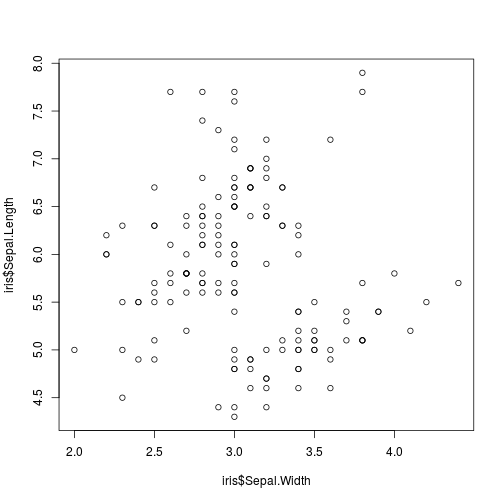

Boxplot
========================================================
<br>

```r
ggplot(data=iris, aes(x = Species, y= Sepal.Length)) + 
  geom_boxplot()
```

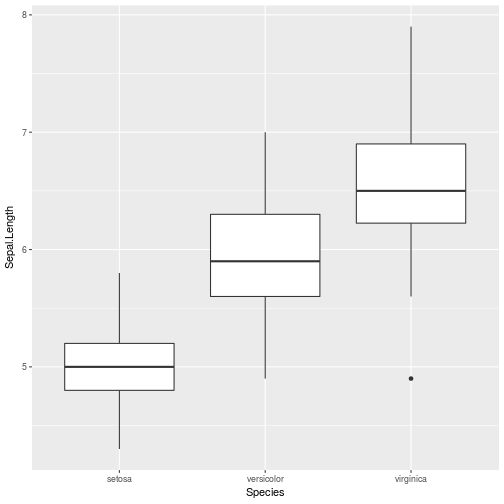
***
Compared with base plot:

```r
plot(iris$Species,iris$Sepal.Length)
```

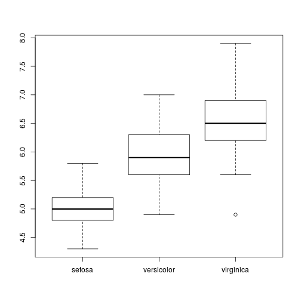

Histogram
========================================================
<br>

```r
ggplot(data=iris, aes(x = Sepal.Length)) + 
  geom_histogram()
```

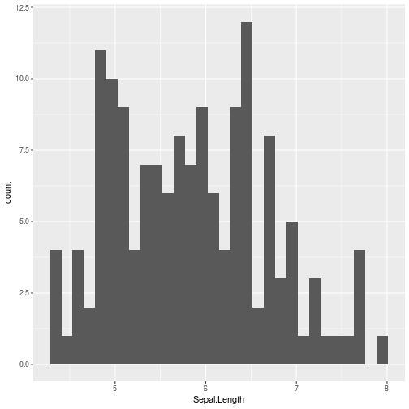
***
Compared with base plot:

```r
hist(iris$Sepal.Length)
```

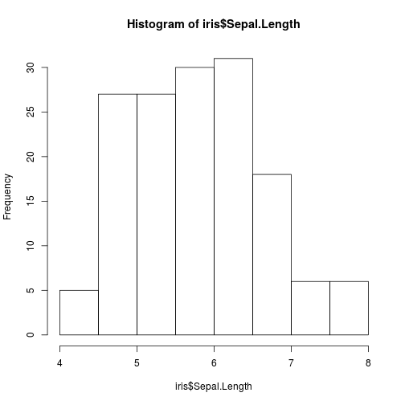

Other possibilities
========================================================
Adding trendline to scatterplot

```r
ggplot(data=iris, aes(x = Sepal.Width, y= Sepal.Length)) + 
  geom_point() +
  geom_smooth(method='lm')
```

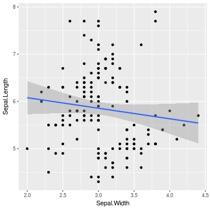

Lots of other possibilities... I
========================================================


Lots of other possibilities... II
========================================================


Lots of other possibilities... III
========================================================


Lots of other possibilities... IV
========================================================


Advantage over base plot - I
========================================================
<br>
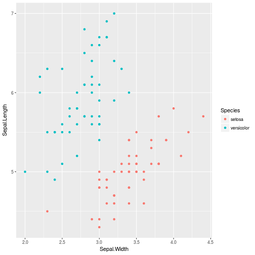
***
Compared with base plot:
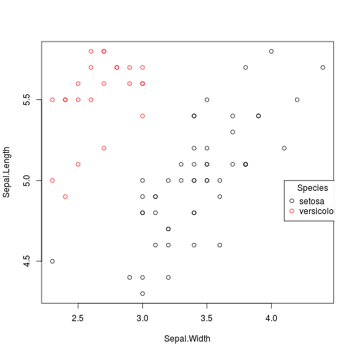
Layout preference debatable...

Advantage over base plot - II
========================================================
<br>
... length of script not so much.

```r
ggplot(subset(iris, Species %in% c("setosa", "versicolor")),
       aes(x=Sepal.Width,
           y=Sepal.Length,
           color=Species))+
  geom_point()
```
***
Compared with base plot:

```r
plot(Sepal.Length ~ Sepal.Width,
     data=subset(iris, Species == "setosa"))
points(Sepal.Length ~ Sepal.Width, col = "red",
     data=subset(iris, Species == "versicolor"))
legend(4.1, 5,
       c("setosa", "versicolor"), title="Species",
       col=c("black", "red"),
       pch=c(1, 1))
```


Not possible
========================================================

- 3d graphics (rgl package)
- interaction networks (igraph or bipartite package)
- interactive graphs (ggvis package)

Plot basics - I
========================================================

__Grammar of graphics__

Building blocks creating graphic displays
- data
- aesthetic mapping
- geometric object
- statistical transformations
- scales
- coordinate system
- position adjustments
- faceting

Plot basics - II
========================================================

ggplot()
- calling plot

aes()
- supplying default data
- aesthethic mappings

+ add components
- layers
- scales
- coords
- facets

(Skipping statistical layers)


Plot basics - Data
========================================================

ggplot calls for data

```r
ggplot(data)
```

Two ways possible

```r
ggplot(data = iris)
```


```r
ggplot(iris)
```

Subsets for data are also possible

```r
ggplot(data = subset(iris, Species %in% c( "sertosa", "versicolor")))
```

Plot basics - Aesthetic mapping - I
========================================================

aes() calls for aesthetic mapping

```r
ggplot(data=iris, aes())
```

Two ways possible

```r
ggplot(data = iris, aes(x = Species, y = Sepal.Length)) + 
  geom_boxplot() 
```


```r
ggplot(iris, aes(Species,Sepal.Length)) + 
  geom_boxplot() 
```


Plot basics - Aesthetic mapping - II
========================================================

More values

* dependent on geom
  + ymin
  + ymax
* graphics related to data
  + fill
  + colour
  + shape
  + size
* groups


Geometic objects (geom) - I
========================================================
Plot type

Boxplot

```r
ggplot(iris, aes(Species,Sepal.Length)) + 
  geom_boxplot() 
```

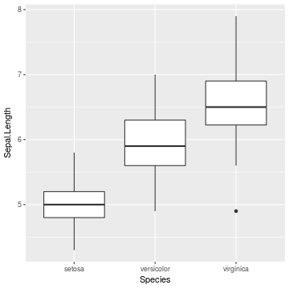


Geometic objects (geom) - II
========================================================
<br>

***


Geometic objects (geom) - III
========================================================


Geometic objects (geom) - IV
========================================================


Labels
========================================================
Title

```r
ggtitle("New title")
```
X axis label

```r
xlab("New x axis title")
```
Title

```r
ylab("New y axis title")
```

Or all together

```r
labs(title="New title", x="New X", y="New Y")
```

Legends 
========================================================
Placement of legend

```r
theme(legend.position = "bottom")
```

Set legend type

```r
guides(colour="none")
```

Remove legend

```r
guides(fill=FALSE)
```
or

```r
theme(legend.position = "none")
```

Faceting- I
========================================================


Faceting - II
========================================================


```r
ggplot(iris, aes(Sepal.Width,Sepal.Length)) + 
  geom_point() +
  facet_grid(.~Species)
```

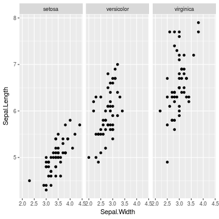

Faceting - III
========================================================

Adjustments
- scales
- labels


```r
ggplot(iris, aes(Sepal.Width,Sepal.Length)) + 
  geom_point() +
  facet_grid(.~Species,scales="free")
```

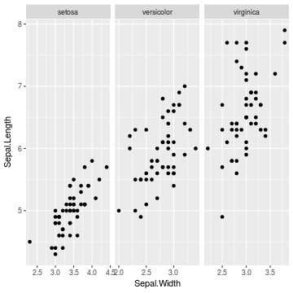


Scales - I
========================================================
Scales control how a plot maps data values to visual values of an aesthetic.


Scales - II
========================================================
Example: setting legend

```r
scale_fill_discrete(name="Tested species", labels = c("Setosa","Versicolor","Virginica"))
```


```r
ggplot(iris, aes(Sepal.Width,Sepal.Length, colour=Species)) + 
  geom_point() +
  scale_fill_discrete(name="Tested species", labels = c("Setosa","Versicolor","Virginica"))
```


Scales - III
========================================================


***


Themes - I
========================================================
Available themes

```r
theme_gray()
```


```r
theme_bw()
```


```r
theme_classic()
```


ggthemes Package

Themes - II
========================================================
Within every theme there are elements

```r
line = element_line()
rect = element_rect()
text = element_text()
axis.line.x = element_blank()
axis.tick =
legend.background = element_rect()
panel.background = 
strip.placement.y =
plot.caption = 
```
[Find all elements here](https://github.com/tidyverse/ggplot2/blob/master/R/theme-defaults.r)

Themes - III
========================================================
Within each element you can change
Similar to base plot
- size
- colour
- linetype
- margins
- ...and much more

[For more inspiration](https://github.com/tidyverse/ggplot2/blob/master/R/theme-defaults.r)


Putting graphs together - I
========================================================

Every ggplot object can be given a name


```r
plot1 = ggplot(iris, aes(Species,Sepal.Length)) + 
  geom_boxplot() 

plot2 = ggplot(iris, aes(Sepal.Width,Sepal.Length, col=Species)) + 
  geom_point()
```

Using gridExtra

```r
library(grid)
library(gridExtra)
```

Putting graphs together - II
========================================================


```r
grid.arrange(plot1, plot2, plot1,
             ncol=2,
             top="General title",
             bottom = "General x axis",
             left = " General y axis",
             right = "General 2nd y axis")
```


(sorry, this somehow failed incorporate in R presentation)
More complex layouts are possible

[Link](https://cran.r-project.org/web/packages/gridExtra/vignettes/arrangeGrob.html)


Some handy functions - I
========================================================

Returning the last plot

```r
last_plot()
```


<br>

Saving a plot (last plot)

```r
ggsave("plot.png",width=5,height = 5)
```
_(size is in inch)_

Some handy functions - II
========================================================

__qplot vs ggplot__
ggplot

```r
ggplot(iris, aes(Sepal.Width,Sepal.Length,col=Species)) + 
  geom_point()
```

qplot

```r
qplot(x=Sepal.Width,y=Sepal.Length,col=Species,data=iris,geom="point")
```

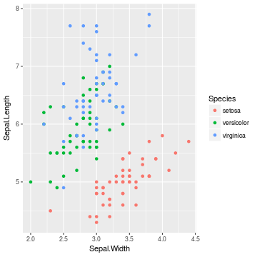
