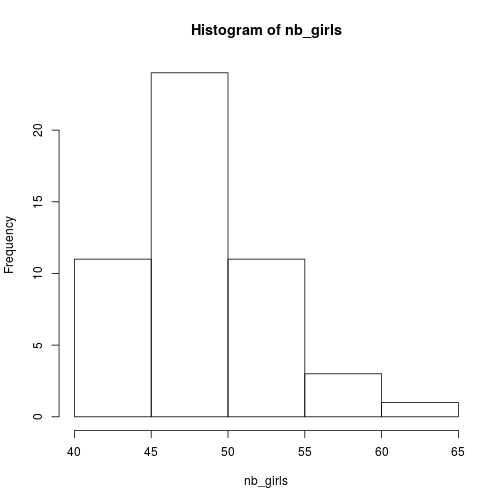
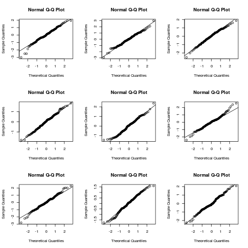

simu_pres
========================================================
author: Lionel Hertzog
date: 23.05.2018
autosize: true
width: 1920
height: 1080

Simulation: what is it?
========================================================

What is simulation for you?


Simulation: what is it?
========================================================

What Wikipedia says: 

"Simulation is the **imitation** of the operation of a real-world process or system. The act of simulating something first requires that a **model** be developed; this model represents the key characteristics, behaviors and functions of the selected physical or abstract system or process. The model **represents** the system itself, whereas the simulation represents the **operation** of the system over time."

Generating stochasticity - the r* functions
========================================================

Generate **r**andom **unif**orm values:


```r
runif(n = 10, min = 0, max = 10)
```

```
 [1] 0.3086941 5.8229545 7.5679119 1.8070141 0.9471185 6.4947998 7.0755857
 [8] 2.6405264 5.9300886 5.5286127
```

Generate **r**andom **norm**al values:


```r
rnorm(n = 10, mean = 0, sd = 5)
```

```
 [1]   8.269181   4.996557  -1.629924  -2.823413   1.511992   7.846640
 [7]   7.649506 -11.548628   4.302251   1.514293
```

Generating stochasticity - the r* functions
========================================================

Generate **r**andom **binom**ial values:


```r
rbinom(n = 10, size = 10, prob = 0.5)
```

```
 [1] 5 5 6 4 6 4 6 4 2 9
```

Generate **r**andom **pois**son values:


```r
rpois(n = 10, lambda = 5)
```

```
 [1] 7 4 2 9 5 3 5 3 8 5
```


Simple simulation example
========================================================

The probability that a baby is a girl is 48.8%, suppose we go to an hospital which recently had 100 births, how many of them can we expect to be girls?


```r
rbinom(n = 1, size = 100, prob = 0.488)
```

```
[1] 44
```

Or:


```r
sum(rbinom(n = 100, size = 1, prob = 0.488))
```

```
[1] 50
```

Exercice
========================================================

As this is a stochastic (random) draw, the best would be to repeat this, say 50 times, to get an idea of the **distribution** of expected number of girls.

Your task:

* Generate 50 simulated values
* Plot an histogram for these values


Using simulations to test model fitness
====================================================

* Every statistical models make some assumptions about the process that generated the data

* We could use this idea for:
   * A priori exploration of models via fake data simulations (power analysis)
   * A posteriori checks that the model is OK (residual checks and parametric bootstrapped)
   
Fake-data simulation - Exercice
===================================================

Assuming a simple linear regression:

$$y \sim N( \alpha + \beta * x, \sigma) $$

Simulate some fake data given:


```r
n <- 30
alpha <- 1
beta <- 2
sigma <- 1
x <- 1:n
```

* Then fit a **lm** to this data and check if the model worked good.
* Try out different sample size, what happens?
* Put this into a function

Power analysis
===================================================

This could be easily extended to do power analysis

* Generate fake data **N** time with varying sample size
* Fit the model to each fake data set
* Grab the p-value(s) of the parameter(s) of interest
* Compute the proportion of times the parameter(s) was/were significant (this is power)

Power analysis - Exercice
================================================

Conduct a power analysis of the **regression slope** with the following model:

$$ y \sim Poisson(exp(0.5 + 0.25 * x)) $$

With x:

```r
x <- runif(10, -2, 2)
```

The sample size varying from 10 to 100 in steps of 10.

Hint: Think function!

Basic steps for fake-data simulation
============================================

* Write down the model
* Give numeric values to all parameters in the models
* Derive the model matrix (the explanatory variables)
* Draw (many times) response values using one of the r* functions

Simulation for checking model fit
===============================================

The idea:

* If the model does a good job of capturing the data-generating process then:
* data simulated based on the model fit should not be too far from the real data
* this can be used to, for instance: residuals checks, checking some statistic of the data, over or underdispersion ...

Simulation for checking model fit - Example I
===============================================


```r
data(iris)
m <- lm(Sepal.Length ~ Sepal.Width, iris)
qqnorm(resid(m))
qqline(resid(m))
```



Simulation for checking model fit
===============================================


```r
iris <- cbind(iris, simulate(m, nsim = 9))
new_resid <- sapply(1:9,function(i){
  m_n <- lm(as.formula(paste0("sim_",i," ~ Sepal.Width")),iris)
  resid(m_n)
})
par(mfrow=c(3,3))
for(i in 1:9){
  qqnorm(new_resid[,i])
  qqline(new_resid[,i])
}
```



Simulation for checking model fit - Exercice
==============================================

Fit the following model to the __iris__ dataset:

$$Sepal.Length \sim N(\alpha + \beta * Sepal.Width, \sigma)$$

* Simulate 10 new set of Sepal Length from this model,
* re-fit models to these different simulations and 
* check the homogeneity of the variance of these simulated data (residuals vs fitted values)
* Bonus: simulate new set of response variables without using the simulate functions
* Bonus: load the dataset "test_data.csv" into R, fit the following model: 
      glmer(observedResponse ~ Environment1 + (1|group) , family = "poisson", data = ...), try to find out if the data are over or underdispersed

Basic steps for model checking simulation
==========================================

* Draw new response variables based on the model via **simulate**
* re-fit the model to these new response variables
* extract the value(s) of interest: number of 0s, residuals ...
* this is equivalent to parametric bootstrapping

More things to check out
======================================

* The DHARMa package
* https://rpubs.com/hughes/68723 (shameless self promotion)
* The ARM book: http://www.stat.columbia.edu/~gelman/arm/ (chapters 7 and 8)

Simulating ecological processes
=====================================

Simulation does not stop at statistical models, any models can be simulated

For instance, imagine a predator having a success rate of 50% in successfully subduing a prey, we can easily simulate a predator attacking 10 times using our simulation knowledge:


```r
rbinom(n = 10, size = 1, prob = 0.5)
```

```
 [1] 0 0 1 1 0 0 0 0 1 1
```

Simulating ecological processes - Exercice
======================================

To make it more interesting, assume that each attack is consuming energy and so after each failed attack the success of the subsequent attack is declined by 10%

* Simulate 10 attacks taking the starvation into account
* Bonus: put this in a function to be able to vary the number of attacks, the baseline sucess rate but also the decline in attack success
* Bonus: simulate several individuals and plot the distribution of total number of subdued preys

Simulating ecological processes - Movement
=============================

Movement is a cool process to simulate

Movement can be simulated based on two information:
* step length
* turning angles

And from the following infos:

* new_x = old_x + length * cos(angle)
* new_y = old_y + length * sin(angle)

Simulate the random walk of an individual assuming uniform angle distribution and normally distributed step length with mean 10 and sd 2

Bonus: make it a function and simulate different individuals
Bonus: Try different distributions for step length and turning angles


Simulation - final words
=============================

Simulations is really about two things:

* A model of how the world work (can be any type of model)
* Some stochasticity in certain aspects of the models (the magic "~")


