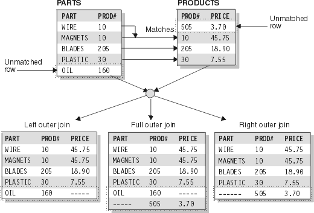
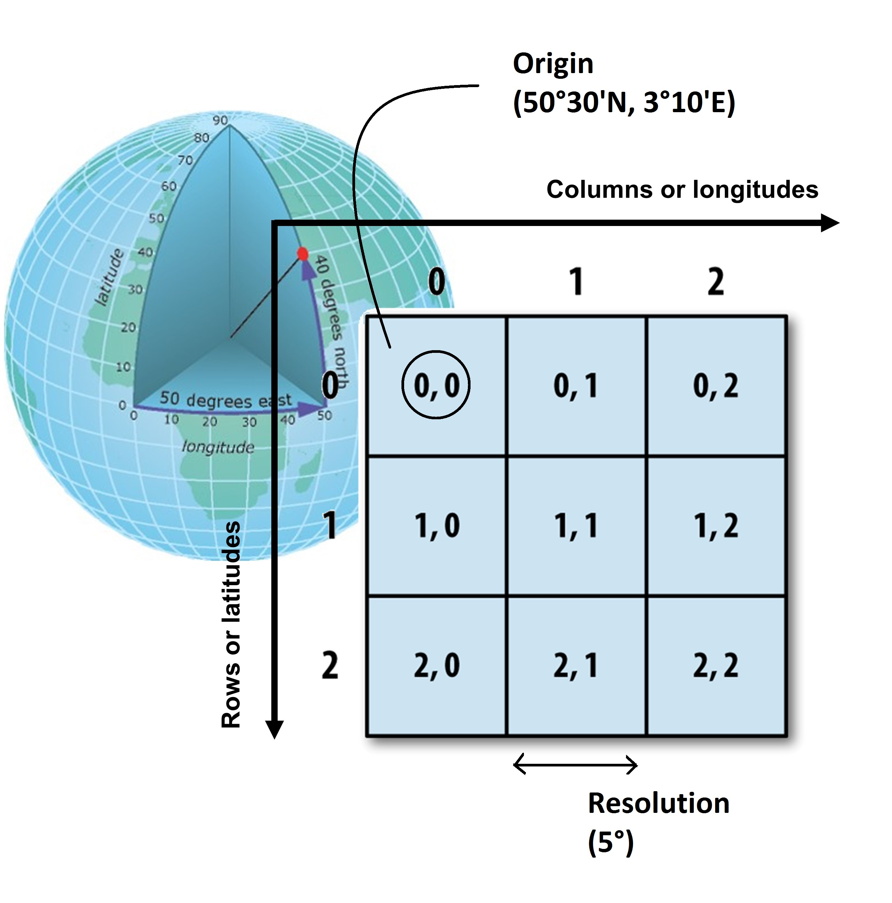
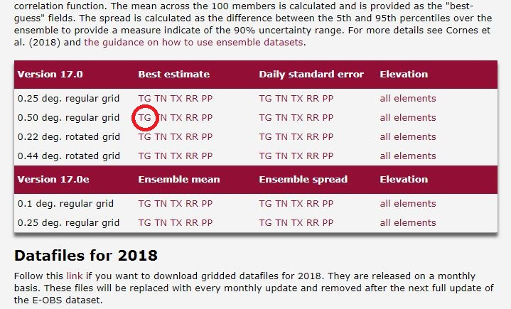

```{r setup, include=FALSE}
knitr::opts_chunk$set(echo = TRUE)
library(knitr)
hook_output <- knit_hooks$get("output")
knit_hooks$set(output = function(x, options) {
   lines <- options$output.lines
   if (is.null(lines)) {
     return(hook_output(x, options))  # pass to default hook
   }
   x <- unlist(strsplit(x, "\n"))
   more <- "..."
   if (length(lines)==1) {        # first n lines
     if (length(x) > lines) {
       # truncate the output, but add ....
       x <- c(head(x, lines), more)
     }
   } else {
     x <- c(more, x[lines], more)
   }
   # paste these lines together
   x <- paste(c(x, ""), collapse = "\n")
   hook_output(x, options)
 })
```

## Data?


## Datasets, dimensions and file formats

* <b>Tabular data:</b> 
    - e.g. synonyms of scientific names, species traits, field data
    - .csv, .xlsx, .json, .sql

* <b>Spatial data (2D):</b> 
    - e.g. soil maps, land use maps, plot locations, country borders
    - .shp, .tif, .asc, .jpg, .img, .png

* <b>Spatio-temporal data (3D):</b> 
    - e.g. climate data, species distirbution data
    - .nc

## Finding data 

* Public agencies
    - https://www.geopunt.be
    - https://data.nasa.gov
    - https://www.eea.europa.eu/data-and-maps 
* Project websites: 
    - https://www.worldclim.org
    - https://www.cru.uea.ac.uk/
    - https://www.try-db.org/
* Supporting information
    - https://www.dataone.org/
* Data archives 

#1. Tabular data

## Tabular data

```{r define dataframes, include=FALSE}
df1 <- data.frame(
  Name=c('Fraxinus excelsior','Fagus sylvatica','Picea abies','Fagus sylvatica','Larix decidua'),
  Type=c("Deciduous","Deciduous","Evergreen","Deciduous","Deciduous"),
  Height=c(25,30,22,12,25),
  LitterQuality = c(8,3,1,3,1))

df2 <- data.frame(
  Name=c('Picea abies','Fagus sylvatica','Quercus robur'),
  LeafType=c('Needle',"Broadleaf","Broadleaf"))
```

```{r show dataframe}
df1
```

## Joining tabular data

- You need a link!
    - timestamps
    - plot IDs
    - species names
    - ...

## Joining data in R

```{r dataframe join example}
df1
df2
```

## Joining data in R

```{r merge function}
merge(df1,df2,by="Name") #all=TRUE, all.x=TRUE, all.y=TRUE
```

```{r join function}
library(plyr)
join(df1,df2,by='Name') #type='left','right','inner' or 'full'
```

## Joining data in R



## Joining data in R

```{r join function with type}
join(df1,df2,by='Name',type="right")
join(df1,df2,by='Name',type="full")
```

#2. Spatial data

## Spatial data


## Spatial data in R

```{r define matrix, echo=TRUE,include=FALSE}
SpatialData=matrix(runif(n=25,min=0,max=1),nrow=5,ncol=5,byrow =TRUE)
```

```{r retrieve matrix values}
SpatialData
SpatialData[2,2]
```

## Spatial data in R

```{r retrieve matrix values based on coordinates, eval=FALSE}
SpatialData[latitude,longitude]
SpatialData[53.03°,3.75°]
```

## From coordinates to matrix indices



## The raster package

```{r introduction raster package (1)}
library(raster)
SpatialData <- raster(SpatialData)
extent(SpatialData) <- c(0,4,50,55) #(xmin,xmax,ymin,ymax)
projection(SpatialData) <- crs("+proj=longlat +datum=WGS84")
print(SpatialData)
```

## Extracting values

```{r introduction raster package (2)}
coordinates <- data.frame(xcoords = c(1,2,5),ycoords = c(51,51,52))
coordinates
extract(SpatialData,coordinates)
```

## Exercise 2.1

Extract data from the matrix below at spatial location with coordinates 51°N,2°W

```{r exercise 2.1,eval=FALSE}
# matrix
SpatialData=matrix(seq(25),nrow=5,ncol=5,byrow =TRUE)
# coordinates of the centre of the upperleft cell: 53°N,1°W
origin <- c(53,1) 
# resolution or width of each cell in degrees
resolution <- 2 
```

```{r exercise 2.1 solution,eval=FALSE,include=FALSE}
# INSERT SOLUTION HERE
```

#3. Spatio-temporal data

## Spatio-temporal data


## Climate data example

http://surfobs.climate.copernicus.eu//dataaccess/access_eobs.php



## Climate data example

```{r plot as example(1),include=FALSE}
# using raster package
library(raster)
tg.b <- brick("./tg_0.50deg_reg_v17.0.nc")
```

```{r plot as example(2),echo=FALSE}
# plot several timeslices
plot(tg.b[[1:9]])
```

## Handling netCDF files

```{r netCDF files (1),output.lines=3:9}
# load netcdf libraries
library(ncdf4)
# open NetCDF file
MeanTemp <- nc_open("./tg_0.50deg_reg_v17.0.nc")
# check properties of the dataset
print(MeanTemp)
```

## Handling netCDF files

```{r netCDF files (2),output.lines=11:23}
# check properties of the dataset
print(MeanTemp)
```

## Handling netCDF files

```{r netCDF files (3)}
# retrieve data on one variable
# >> ncvar_get(ncdf_file,variablename)

# examples
head(ncvar_get(MeanTemp,'latitude'))
head(ncvar_get(MeanTemp,'longitude'))
head(ncvar_get(MeanTemp,'time'))
```

## Extracting data with raster package

```{r introducting bricks}
library(raster)
tg <- brick("./tg_0.50deg_reg_v17.0.nc")
coordinates <- data.frame(x=c(3.75),y=c(51.03))
data <- extract(tg,coordinates)
data[,1:4]
```

## Looking for a specific date

```{r searching for a date}
start_date <- as.Date("01 01 1950",format="%d %m %Y")
print(start_date)
date <- as.Date("02 10 2008",format="%d %m %Y")
print(date)
numberofdays <- difftime(date,start_date,units="days")
colnames(data)[numberofdays+1]
```

## Exercise 3.1

Write two functions that return the mean temperature for a given location, once for a specified date and once for a specified period

```{r exercise 3.1, eval=FALSE}
DayTemp <- function (latitude,longitude,date){
  
  return (temperature_value)
}

TempData <- function (name_of_location,latitude,longitude,
                      start_date,end_date){
  
  df <- data.frame(Name = ..., Date = ..., Year = ..., 
                   Temperature = ...)
  return (df)
}
```

```{r exercise 3.1 solution,eval=FALSE,include=FALSE}
#INSERT SOLUTION HERE
```

## Exercise 3.2

Add mean annual temperature data to the understorey biomass dataset, use 1995-2000 data only

```{r exercise 3.2}
biomass_data <- read.csv('./Biomass.csv')
head (biomass_data)
```

```{r exercise 3.2 solution,eval=FALSE,include=FALSE}
#INSERT SOLUTION HERE
```
